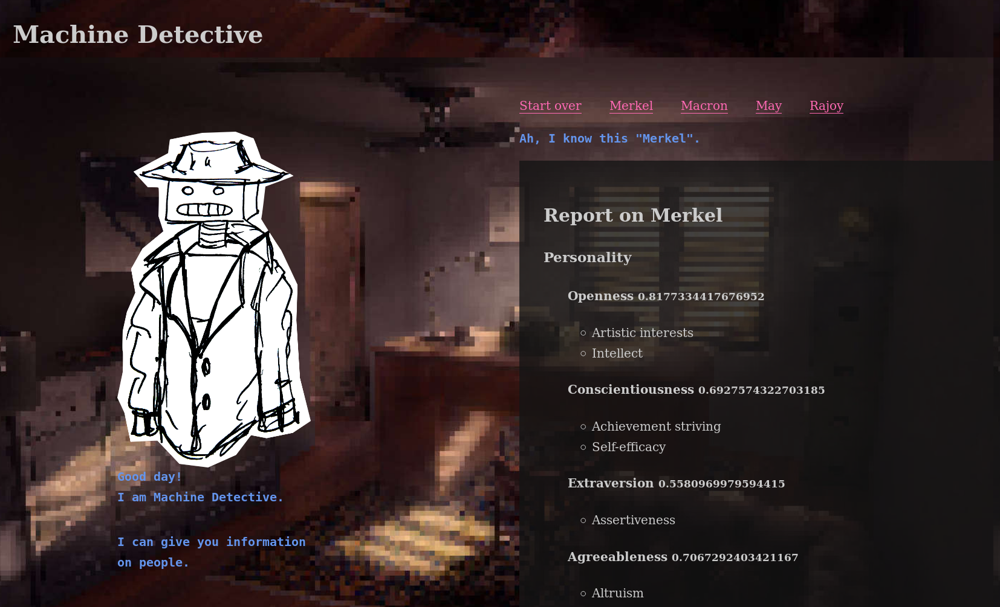

# Machine Detective

## Make your own!

## IBM Watson

Machine Detective uses IBM Watson (the coolest and creepiest machine of all time) for personality analysis.

You need to sign up at IBM Cloud and create a Watson project/ service to obtain API credentials.

Once you have credentials continue!

## Config

Create an .env from the example file and insert your credentials

`$ cp env.sample .env`

## Asset sources

- Original background: https://silberius.deviantart.com/art/Detective-office-496721164

## Sources for politicians' speacher

Please keep in mind that most of these transcripts are translations and bear natural errors.
Also the speaches usually on one topic which limits the range of expression.

Please also be aware that I personally picked the display of personality aspects and that means that other aspects could be missing.

- Merkel: [G20 Dialogue Forum with Women (W20) in Berlin on 26 April 2017](https://www.bundesregierung.de/Content/EN/Reden/2017/2017-04-26-bk-merkel-w20_en.html;jsessionid=0F78086F9142B7BBE15A8327F2159DA6.s5t1?nn=393812)
- Rajoy: [Trump and Rajoy News Conference](http://www.cnn.com/TRANSCRIPTS/1709/26/cnr.05.html)
- Macron: [Full transcript of Emmanuel Macron speech 8 May 2017](http://www.bbc.com/news/world-europe-39842084)
- May: [Theresa May’s speech to the Conservative Party Conference – in full](https://www.independent.co.uk/news/uk/politics/theresa-may-s-speech-to-the-conservative-party-conference-in-full-a6681901.html)
